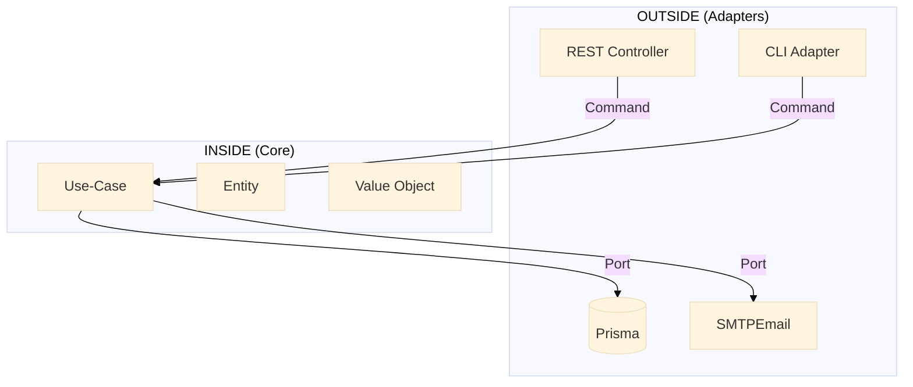
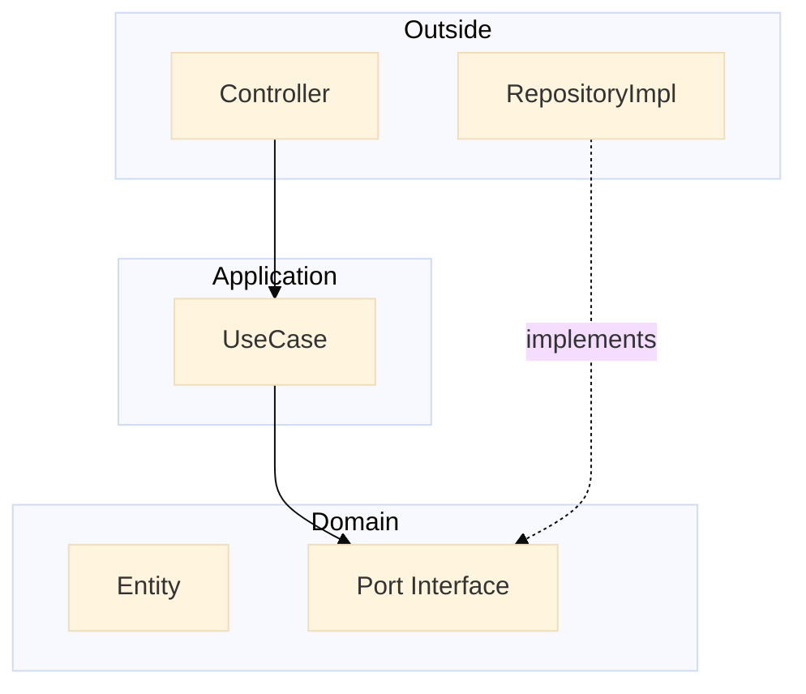
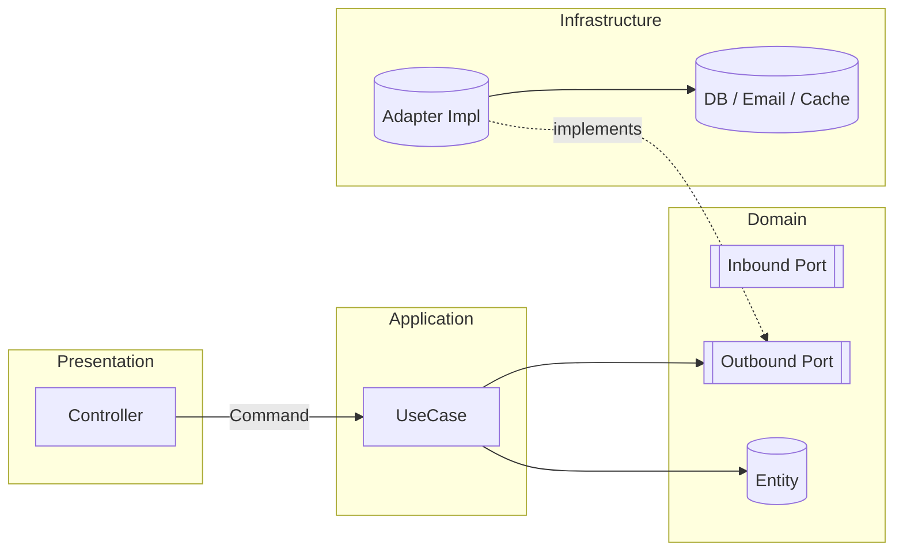
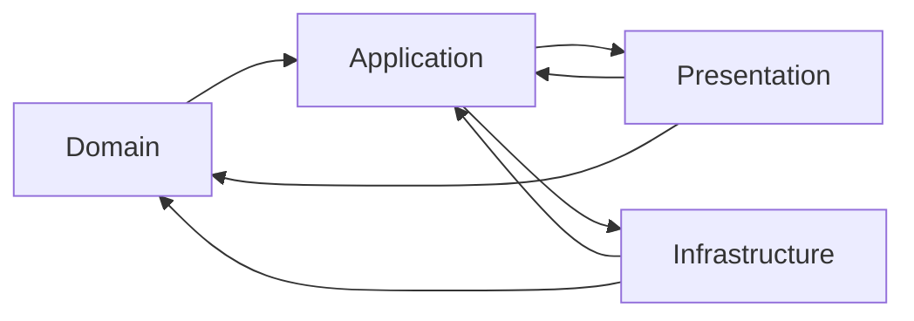

# 📘 **The Hexagonal Architecture Handbook**  
> **NestJS + TypeScript** – **Absolute Beginner Edition**  
> **Version 2.1 – Sept 2025**  
> *“Zero-to-hero guide for developers who have NEVER touched hexagonal architecture”*

> If you are new: skim 0 → 4, then pin the TL;DR poster. If you are reviewing a PR: jump to section 9 (Checklist) + 11 (Dependency Matrix). If refactoring legacy code: read 8.1 + 9.1.

---

## 🍕 **0. The Pizza Metaphor** (30-second primer)

| Role | Hexagon Meaning |
|---|---|
| **Chef** | **Domain** – the business rules |
| **Recipe** | **Application Use-case** – “how to bake today” |
| **Oven / Knife / Waiter** | **Adapters** – tools the chef *uses* |
| **Order Ticket** | **Command** – plain data the waiter brings |

> **Golden rule**: The chef never imports an oven.  
> If tomorrow the oven is replaced by a wood fire, the recipe still works.

### 0.1 **Why Hexagonal *in THIS project?***

| Problem (Before) | Pain | Hexagonal Answer |
|---|---|---|
| Direct Prisma / framework imports everywhere | Hard to test / swap DB | Outbound ports + adapters |
| DTO validation mixed with business rules | Duplication / leaks | Value Objects centralize invariants |
| Controllers returning persistence models | Bleeding internal schema | Mapping + pure domain return |
| Refactors caused chain edits | High coupling | Inward dependency rule |
| Hard to write fast unit tests | Needed DB for everything | In-memory fakes at use-case layer |

**Goal here**: Keep domain stable while adapters (DB, email, cache, auth providers) can churn freely.

---

## 🧭 **1. Two-Circle Mindset**



- **INSIDE** = `domain/` + `application/`  
- **OUTSIDE** = `presentation/` + `infrastructure/`  
- **Arrows point INWARD only**

---

## 📁 **2. Folder Map – Copy-Paste Ready**

```
src/
├── domain/                 # Pure business rules
│   ├── entities/           # User, Invoice, etc.
│   ├── value-objects/      # EmailVO, MoneyVO, etc.
│   ├── ports/
│   │   ├── inbound/        # Use-case interfaces
│   │   └── outbound/       # Repository / gateway interfaces
│   └── constants/          # Domain-only constants
├── application/            # Orchestrates domain
│   └── use-cases/          # Concrete handlers
├── presentation/           # REST, GraphQL, CLI
│   ├── dto/
│   ├── controllers/
│   └── mappers/
└── infrastructure/         # Framework & 3rd-party
    ├── adapters/
    │   ├── persistence/
    │   └── email/
    └── config/
```

---

## 🔗 **3. Dependency Direction – Visual Proof**



- **Domain** never imports outside.  
- **Use-case** only imports `domain/`.

### 3.1 **Ports Deep Dive (Inbound vs Outbound)**



| Type | Defined In | Owned By | Implemented By | Example |
|---|---|---|---|---|
| Inbound Port | `domain/ports/inbound` | Domain | Application (use-case) | `FindUsersPort` |
| Outbound Port | `domain/ports/outbound` | Domain | Infrastructure adapter | `UserRepositoryPort` |

> **Mnemonic**: *Inbound = what the world asks me to do. Outbound = what I need from the world.*

---

## 🧪 **4. Lifecycle of a “Create User” Request**

| Step | Layer | Code Snippet |
|---|---|---|
| 1 | **Presentation** | `POST /users` → `CreateUserDto` |
| 2 | **Presentation** | `CreateUserMapper.toCommand(dto)` |
| 3 | **Presentation** | `createUserUseCase.execute(command)` |
| 4 | **Application** | `userRepo.existsByEmail(email)` |
| 5 | **Application** | `User.create(...)` (domain) |
| 6 | **Application** | `userRepo.save(user)` |
| 7 | **Infrastructure** | Prisma inserts row |
| 8 | **Application** | returns `UserCreated` |
| 9 | **Presentation** | `201 Created` JSON |

---

### 4.1 **End-to-End Code Slice (Real Simplified Example)**

Controller snippet (presentation):
```ts
@Post('users')
async create(@Body() dto: CreateUserDto) {
    const command = CreateUserMapper.toCommand(dto); // pure data
    const user = await this.createUserUseCase.execute(command); // domain entity
    return UserResponseMapper.toDto(user); // framework-friendly DTO
}
```

Use-case (application):
```ts
@Injectable()
export class FindUsersUseCase {
    constructor(@Inject(UserRepositoryPort) private readonly users: UserRepositoryPort) {}
    async execute() { return this.users.findAll(); }
}
```

Outbound port (domain):
```ts
export interface UserRepositoryPort {
    findByEmail(email: Email): Promise<User | null>;
    save(user: User): Promise<void>;
}
```

Adapter (infrastructure):
```ts
@Injectable()
export class PrismaUserRepositoryAdapter implements UserRepositoryPort {
    constructor(@Inject(PrismaService) private readonly prisma: PrismaService) {}
    async findByEmail(email: Email) { /* prisma call + map to domain */ }
    async save(user: User) { /* upsert + mapping */ }
}
```

Value Object (shared/domain):
```ts
export class PasswordVo {
    static of(raw: string) { this.validatePasswordStrength(raw); return new PasswordVo(raw as Password); }
    // validation rules...
}
```

> **Trace rule**: At no point does the domain import NestJS, class-validator, or Prisma.

---

## 🧩 **5. Layer Cheat-Sheet**

| Layer | May Import From | Example |
|---|---|---|
| **Domain** | Nothing | `EmailVO`, `User` |
| **Application** | `domain/` only | `RegisterUserHandler` |
| **Presentation** | `application/` | `AuthController` |
| **Infrastructure** | `application/` + `domain/` (via ports) | `PrismaUserRepository` |

---

## 📦 **6. Commands, DTOs & Value Objects**

| Type | Location | Contains… | Framework? |
|---|---|---|---|
| **Command** | `domain/ports/inbound/` | Plain `{email, password}` | ❌ |
| **DTO** | `presentation/dto/` | `@IsEmail()` decorators | ✅ |
| **Value Object** | `domain/value-objects/` | Business validation | ❌ |

---

### 6.1 **Value Objects in Action**

| Benefit | Without VO | With VO |
|---|---|---|
| Centralized validation | Scattered `if` checks | Single constructor guard |
| Impossible invalid state | Runtime surprises | Construction throws early |
| Self-documenting intent | Ambiguous `string` | Explicit `PasswordVo` |
| Reusable across uses | Duplicated regex | One canonical rule |

Example (`PasswordVo` excerpt):
```ts
static of(raw: string): PasswordVo {
    this.validatePasswordStrength(raw); // length, upper, lower, digit, special
    return new PasswordVo(raw as Password);
}
```

> **Guideline**: Promote to VO whenever a primitive has: validation logic, formatting rules, equality beyond reference, or cross-cutting invariants.

---

## 🧪 **7. Testing Matrix**

| Test Scope | Tool | Example |
|---|---|---|
| **Domain** | Jest | `User.shouldRejectInvalidEmail()` |
| **Use-case** | Jest + In-Memory | `RegisterUserHandler` with fake repo |
| **Adapter** | Jest + Testcontainers | `PrismaUserRepository` with real DB |
| **E2E** | Supertest | Full HTTP round-trip |

---

### 7.1 **Test Doubles Strategy**

| Layer Under Test | Use Doubles For | Real For | Rationale |
|---|---|---|---|
| Domain entity / VO | Everything | None | Pure & fast |
| Use-case | Outbound ports | Domain logic | Detect orchestration bugs |
| Adapter | External deps (optionally Testcontainers) | The adapter code | Validate mapping & error translation |
| E2E | None | Full stack | Contract + wiring |

Common doubles:
```ts
class InMemoryUserRepository implements UserRepositoryPort {
    private data = new Map<UserId, User>();
    async findByEmail(email: Email) { return [...this.data.values()].find(u => u.email.getValue() === email) ?? null; }
    async save(user: User) { this.data.set(user.id, user); }
    // others omitted
}
```

> Keep in-memory fakes inside `test/**/fixtures` to avoid accidental production use.

---

## ⚠️ **8. Common Beginner Mistakes**

| Mistake | Fix |
|---|---|
| `@IsEmail()` in Command | Move to DTO |
| Importing `PrismaService` in Use-case | Inject via `UserRepository` port |
| Returning `UserDto` from Use-case | Return domain entity |
| Controller inside `application/` | Move to `presentation/` |

---

### 8.1 **Code Smells & Fix Patterns**

| Smell | How It Looks | Fix |
|---|---|---|
| Framework import in domain | `import { Injectable } from '@nestjs/common'` | Remove decorator; move service logic to use-case |
| Adapter returns raw Prisma model | Controller sees DB shape | Map to domain entity first |
| DTO reused as command | Mixes decorators + business types | Create plain command interface in inbound port |
| Widespread `string` for email | Repeated regex | `EmailVo.of(raw)` |
| Use-case returning HTTP status | Cross-layer leakage | Return pure data / entity, controller decides status |
| Broad catch swallowing errors | Silent failures | Translate infra → domain-specific exception |

> **Heuristic**: If changing a library forces edits in 3+ layers, coupling boundary is misplaced.

---

## 🏁 **9. Quick Checklist (before commit)**

- [ ] No file in `domain/` imports from `presentation/` or `infrastructure/`.  
- [ ] Every repository interface is under `domain/ports/outbound/`.  
- [ ] Every use-case interface is under `domain/ports/inbound/`.  
- [ ] Each use-case implementation is under `application/use-cases/`.  
- [ ] Adapters implement the ports, never expose implementation details.

---

### 9.1 **Refactor Playbook (Legacy → Hexagonal)**

| Step | Action | Result |
|---|---|---|
| 1 | Identify framework-dependent logic in domain/use-case | Candidate for extraction |
| 2 | Define outbound port in `domain/ports/outbound/` | Stable contract |
| 3 | Implement adapter under `infrastructure/adapters/...` | Concrete integration |
| 4 | Inject port token via constructor | Dependency inversion |
| 5 | Add fake in tests; remove direct framework import | Faster isolated tests |
| 6 | Remove dead legacy code | Clean boundary |

Refactor micro-template:
```ts
// Before (use-case coupled to Prisma)
constructor(private prisma: PrismaService) {}
// After
constructor(@Inject(UserRepositoryPort) private users: UserRepositoryPort) {}
```

---

## 🧱 **10. Exception / Error Strategy**

| Layer | Exception Type | Purpose | HTTP Mapping (suggested) |
|---|---|---|---|
| Domain | `UserAlreadyExistsException` | Business rule violated | 409 Conflict |
| Domain | `WeakPasswordException` | Invariant failure | 422 Unprocessable Entity |
| Application | (rare) Orchestration errors | Compose domain failures | 400/422 |
| Infrastructure | `PersistenceInfrastructureException` | Technical failure | 500 Internal Server Error |
| Auth | e.g. `UnauthorizedException` | Access control | 401/403 |

> Domain exceptions should be explicit classes—no magic strings. Controllers translate them to transport concerns.

Pattern for translation:
```ts
try { await useCase.execute(cmd); } catch (e) {
    if (e instanceof UserAlreadyExistsException) throw new ConflictException(e.message);
    throw e; // bubble unknown
}
```

---

## 🧭 **11. Dependency Matrix (Allowed Directions)**



| From / To | Domain | Application | Presentation | Infrastructure |
|---|---|---|---|---|
| Domain | ✔ | ✔ (types only) | ✖ | ✖ |
| Application | ✔ | ✔ | ✖ | ✖ (only tokens injected) |
| Presentation | ✔ | ✔ | ✔ | ✖ |
| Infrastructure | ✔ | ✔ | ✔ | ✔ |

> If you *need* an arrow that's disallowed: introduce a port. If that still feels wrong: maybe the concept belongs in a different layer.

Rule of enforcement idea: add ESLint boundaries or a custom script to fail imports (future enhancement).

---

## 📝 **12. Changelog**

| Version | Date | Highlights |
|---|---|---|
| 2.1 | 2025-09 | Added ports deep dive, real slice, VO section, test doubles, smells, refactor playbook, exception strategy, dependency matrix, changelog |
| 2.0 | 2025-07 | Initial public structured version with diagrams and checklist |
| 1.x | 2025-03–06 | Internal notes, unstructured draft |

---

## 📚 **References & Further Reading**

| Resource | Author | Year | Link |
|---|---|---|---|
| **Hexagonal Architecture (original paper)** | Alistair Cockburn | 2005 | https://alistair.cockburn.us/hexagonal-architecture/ |
| **Implementing Domain-Driven Design** | Vaughn Vernon | 2013 | Chapter 4 |
| **Clean Architecture** | Robert C. Martin | 2017 | Chapter 22 |
| **Hexagonal Architecture with NestJS** | Pham Tuan Chip | 2024-10-18 | https://medium.com/@phamtuanchip/nestjs-boosting-web-development-speed-with-hexagonal-architecture-5a5a9a04be0d |
| **Hexagonal & Clean Architecture Examples** | Dyarleni Ber | 2024-07-17 | https://dev.to/dyarleniber/hexagonal-architecture-and-clean-architecture-with-examples-48oi |

---

### 📌 TL;DR Poster (print & pin)

```
┌─────────────────────────────────────────────┐
│  OUTSIDE  (Adapters)                        │
│  REST • CLI • DB • Email • Queues           │
└─────┬───────────┬───────────┬───────────────┘
      │           │           │
┌─────┴──┐  ┌─────┴──┐  ┌─────┴──┐
│   P    │  │   A    │  │   I    │
│   R    │  │   P    │  │   N    │
│   E    │  │   P    │  │   F    │
│   S    │  │   L    │  │   R    │
│   E    │  │   I    │  │   A    │
│   N    │  │   C    │  │   S    │
│   T    │  │   A    │  │   T    │
│   A    │  │   T    │  │   R    │
│   T    │  │   I    │  │   U    │
│   I    │  │   O    │  │   C    │
│   O    │  │   N    │  │   T    │
│   N    │  │        │  │   U    │
└──┬─────┘  └──┬─────┘  └──┬─────┘
   │           │           │
   │  ┌────────┴────────┐  │
   │  │   APPLICATION   │  │
   │  │   Use-cases     │  │
   │  └────────┬────────┘  │
   │           │           │
   │  ┌────────┴────────┐  │
   │  │     DOMAIN      │  │
   │  │ Business Rules  │  │
   │  └─────────────────┘  │
```

**Rule of thumb**:  
*If the compiler lets you import from `presentation/` or `infrastructure/` inside `domain/` or `application/`, stop and refactor.*