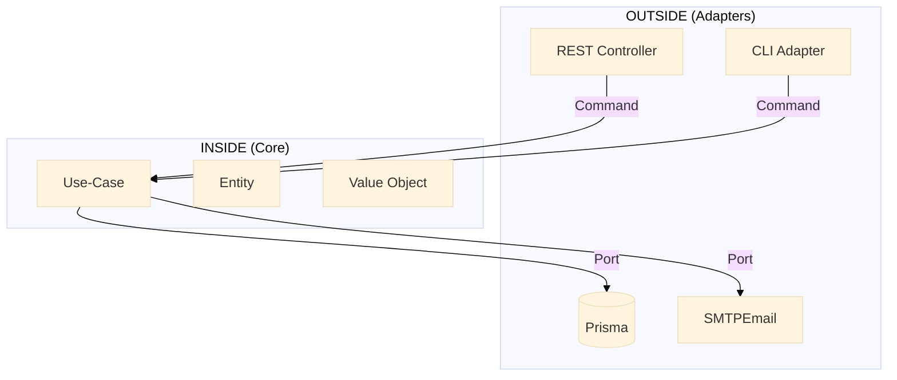
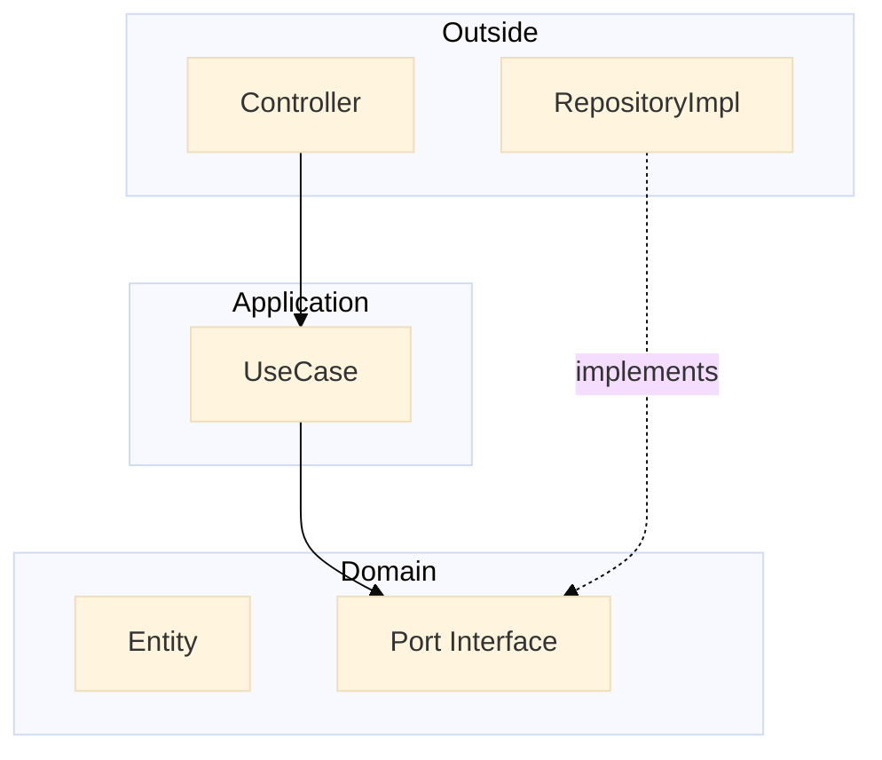

# 📘 **The Hexagonal Architecture Handbook**  
> **NestJS + TypeScript** – **Absolute Beginner Edition**  
> **Version 2.0 – July 2025**  
> *“Zero-to-hero guide for developers who have NEVER touched hexagonal architecture”*

---

## 🍕 **0. The Pizza Metaphor** (30-second primer)

| Role | Hexagon Meaning |
|---|---|
| **Chef** | **Domain** – the business rules |
| **Recipe** | **Application Use-case** – “how to bake today” |
| **Oven / Knife / Waiter** | **Adapters** – tools the chef *uses* |
| **Order Ticket** | **Command** – plain data the waiter brings |

> **Golden rule**: The chef never imports an oven.  
> If tomorrow the oven is replaced by a wood fire, the recipe still works.

---

## 🧭 **1. Two-Circle Mindset**



- **INSIDE** = `domain/` + `application/`  
- **OUTSIDE** = `presentation/` + `infrastructure/`  
- **Arrows point INWARD only**

---

## 📁 **2. Folder Map – Copy-Paste Ready**

```
src/
├── domain/                 # Pure business rules
│   ├── entities/           # User, Invoice, etc.
│   ├── value-objects/      # EmailVO, MoneyVO, etc.
│   ├── ports/
│   │   ├── inbound/        # Use-case interfaces
│   │   └── outbound/       # Repository / gateway interfaces
│   └── constants/          # Domain-only constants
├── application/            # Orchestrates domain
│   └── use-cases/          # Concrete handlers
├── presentation/           # REST, GraphQL, CLI
│   ├── dto/
│   ├── controllers/
│   └── mappers/
└── infrastructure/         # Framework & 3rd-party
    ├── adapters/
    │   ├── persistence/
    │   └── email/
    └── config/
```

---

## 🔗 **3. Dependency Direction – Visual Proof**



- **Domain** never imports outside.  
- **Use-case** only imports `domain/`.

---

## 🧪 **4. Lifecycle of a “Create User” Request**

| Step | Layer | Code Snippet |
|---|---|---|
| 1 | **Presentation** | `POST /users` → `CreateUserDto` |
| 2 | **Presentation** | `CreateUserMapper.toCommand(dto)` |
| 3 | **Presentation** | `createUserUseCase.execute(command)` |
| 4 | **Application** | `userRepo.existsByEmail(email)` |
| 5 | **Application** | `User.create(...)` (domain) |
| 6 | **Application** | `userRepo.save(user)` |
| 7 | **Infrastructure** | Prisma inserts row |
| 8 | **Application** | returns `UserCreated` |
| 9 | **Presentation** | `201 Created` JSON |

---

## 🧩 **5. Layer Cheat-Sheet**

| Layer | May Import From | Example |
|---|---|---|
| **Domain** | Nothing | `EmailVO`, `User` |
| **Application** | `domain/` only | `RegisterUserHandler` |
| **Presentation** | `application/` | `AuthController` |
| **Infrastructure** | `application/` + `domain/` (via ports) | `PrismaUserRepository` |

---

## 📦 **6. Commands, DTOs & Value Objects**

| Type | Location | Contains… | Framework? |
|---|---|---|---|
| **Command** | `domain/ports/inbound/` | Plain `{email, password}` | ❌ |
| **DTO** | `presentation/dto/` | `@IsEmail()` decorators | ✅ |
| **Value Object** | `domain/value-objects/` | Business validation | ❌ |

---

## 🧪 **7. Testing Matrix**

| Test Scope | Tool | Example |
|---|---|---|
| **Domain** | Jest | `User.shouldRejectInvalidEmail()` |
| **Use-case** | Jest + In-Memory | `RegisterUserHandler` with fake repo |
| **Adapter** | Jest + Testcontainers | `PrismaUserRepository` with real DB |
| **E2E** | Supertest | Full HTTP round-trip |

---

## ⚠️ **8. Common Beginner Mistakes**

| Mistake | Fix |
|---|---|
| `@IsEmail()` in Command | Move to DTO |
| Importing `PrismaService` in Use-case | Inject via `UserRepository` port |
| Returning `UserDto` from Use-case | Return domain entity |
| Controller inside `application/` | Move to `presentation/` |

---

## 🏁 **9. Quick Checklist (before commit)**

- [ ] No file in `domain/` imports from `presentation/` or `infrastructure/`.  
- [ ] Every repository interface is under `domain/ports/outbound/`.  
- [ ] Every use-case interface is under `domain/ports/inbound/`.  
- [ ] Each use-case implementation is under `application/use-cases/`.  
- [ ] Adapters implement the ports, never expose implementation details.

---

## 📚 **References & Further Reading**

| Resource | Author | Year | Link |
|---|---|---|---|
| **Hexagonal Architecture (original paper)** | Alistair Cockburn | 2005 | https://alistair.cockburn.us/hexagonal-architecture/ |
| **Implementing Domain-Driven Design** | Vaughn Vernon | 2013 | Chapter 4 |
| **Clean Architecture** | Robert C. Martin | 2017 | Chapter 22 |
| **Hexagonal Architecture with NestJS** | Pham Tuan Chip | 2024-10-18 | https://medium.com/@phamtuanchip/nestjs-boosting-web-development-speed-with-hexagonal-architecture-5a5a9a04be0d |
| **Hexagonal & Clean Architecture Examples** | Dyarleni Ber | 2024-07-17 | https://dev.to/dyarleniber/hexagonal-architecture-and-clean-architecture-with-examples-48oi |

---

### 📌 TL;DR Poster (print & pin)

```
┌─────────────────────────────────────────────┐
│  OUTSIDE  (Adapters)                        │
│  REST • CLI • DB • Email • Queues           │
└─────┬───────────┬───────────┬───────────────┘
      │           │           │
┌─────┴──┐  ┌─────┴──┐  ┌─────┴──┐
│   P    │  │   A    │  │   I    │
│   R    │  │   P    │  │   N    │
│   E    │  │   P    │  │   F    │
│   S    │  │   L    │  │   R    │
│   E    │  │   I    │  │   A    │
│   N    │  │   C    │  │   S    │
│   T    │  │   A    │  │   T    │
│   A    │  │   T    │  │   R    │
│   T    │  │   I    │  │   U    │
│   I    │  │   O    │  │   C    │
│   O    │  │   N    │  │   T    │
│   N    │  │        │  │   U    │
└──┬─────┘  └──┬─────┘  └──┬─────┘
   │           │           │
   │  ┌────────┴────────┐  │
   │  │   APPLICATION   │  │
   │  │   Use-cases     │  │
   │  └────────┬────────┘  │
   │           │           │
   │  ┌────────┴────────┐  │
   │  │     DOMAIN      │  │
   │  │ Business Rules  │  │
   │  └─────────────────┘  │
```

**Rule of thumb**:  
*If the compiler lets you import from `presentation/` or `infrastructure/` inside `domain/` or `application/`, stop and refactor.*