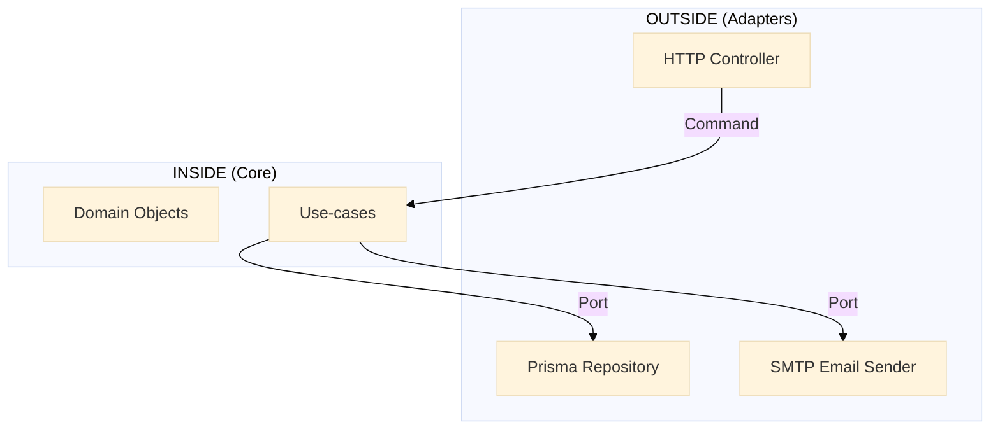
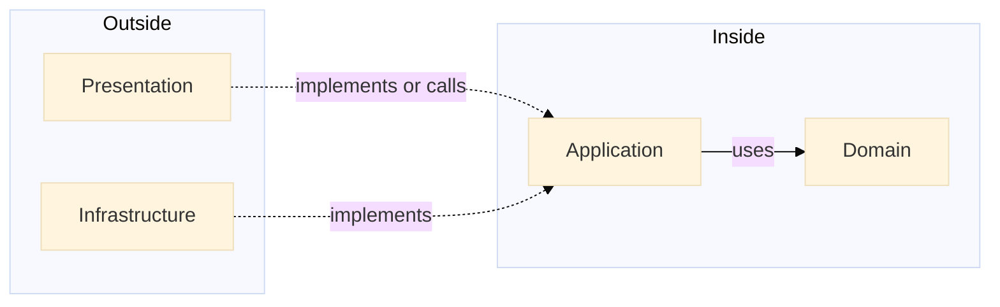

# 📘 The **Hexagonal Architecture Handbook**  
> NestJS Authentication Backend – Absolute Beginner Edition  
> Version 1.0.0 – July 2025  
> “Written for developers who have **never** touched hexagonal architecture before.”

---

## 0. Before You Start – 30-Second Checklist
1. **Forget everything you know about MVC or layered architectures.**  
2. **Think in two circles only**:  
   - *Inside* → business logic  
   - *Outside* → everything else (framework, database, email, queues, etc.)  

---

## 1. **The Hexagon – Explained with a Pizza**

Imagine you are a **pizza chef**.  
Your job: bake the perfect pizza.

| Who / What | Hexagonal Analogy |
|------------|-------------------|
| **You** (the chef) | **Domain** – pure pizza rules |
| **Recipe card** | **Application Use-case** – “how to bake today” |
| **Knife, oven, email order system** | **Adapters** – tools the chef *uses* |
| **Waiter who takes the order** | **Presentation** – brings requests in, delivers pizza out |

> **Key insight**:  
> The chef never *depends* on the waiter or the oven.  
> If tomorrow the waiter becomes a robot or the oven is replaced by a wood fire, *the recipe and the pizza remain the same*.

---

## 2. **Two Circles Only**



- **INSIDE** = `domain/` + `application/`  
- **OUTSIDE** = `presentation/` + `infrastructure/`

> **Rule**:  
> *Inside code knows **nothing** about outside code.*  
> *Outside code knows **about** inside code (it implements or calls it).*

---

## 3. **Folder Map – Step by Step**

```
src/
├── domain/              # ① Where the business lives
│   ├── user.entity.ts
│   └── password.vo.ts
├── application/         # ② How the business is executed
│   ├── ports/
│   │   ├── inbound/     #   Use-case interfaces
│   │   └── outbound/    #   Repository / Email / etc. interfaces
│   └── services/        #   Concrete use-cases
├── presentation/        # ③ How the outside world talks to us
│   ├── dto/
│   └── controllers/
└── infrastructure/      # ④ How we talk to the outside world
    ├── adapters/
    └── config/
```

| Folder | Lives Inside | Imports Allowed From |
|--------|--------------|----------------------|
| `domain/` | **Inside** | Nothing (pure TS) |
| `application/` | **Inside** | Only `domain/` |
| `presentation/` | **Outside** | `application/` |
| `infrastructure/` | **Outside** | `application/` + `domain/` (via ports only) |

---

## 4. **Dependency Direction – The One-Arrow Rule**



> **Arrows point inward only**.  
> No code inside `application/` or `domain/` may import from `presentation/` or `infrastructure/`.

---

## 5. **Lifecycle of a Request – 7-Step Story**

1. **Client** sends JSON to `POST /users`.  
2. **Presentation** (`AuthController`):  
   - Uses NestJS `ValidationPipe` to turn JSON into `CreateUserDto`.  
   - *Maps* DTO → `CreateUserCommand` (plain object).  
3. **Presentation** calls `CreateUserUseCase.execute(command)` – an **interface** in `application/ports/inbound/`.  
4. **Application Service** (`CreateUserService`):  
   - Checks uniqueness through `UserRepositoryPort` (interface).  
   - Creates `User` entity (from `domain/`).  
   - Persists via `UserRepositoryPort` (implemented in `infrastructure/`).  
   - Sends welcome mail via `EmailSenderPort` (interface, implemented in `infrastructure/`).  
5. **Infrastructure Adapters** do the real I/O (Prisma, Nodemailer).  
6. **Application Service** returns a simple result (`UserCreated`).  
7. **Presentation** converts result to HTTP 201 + JSON body.

---

## 6. **Commands & Queries – Simple, Not Patterns**

| Name | What it is | Where defined | Framework? |
|------|------------|---------------|------------|
| `CreateUserCommand` | Plain object `{email, password}` | `application/ports/inbound/` | ❌ |
| `GetUserByIdQuery` | Plain object `{id}` | `application/ports/inbound/` | ❌ |
| `CreateUserDto` | Class with `@IsEmail()` decorators | `presentation/dto/` | ✅ Nest |

> **Remember**: Commands/Queries are **just data bags**; they carry **no behavior** and **no decorators**.

---

## 7. **Common Beginner Mistakes (and Fixes)**

| Mistake | Why it hurts | Safe Fix |
|---------|--------------|----------|
| Importing `PrismaService` in a use-case | Couples business to ORM | Inject via `UserRepositoryPort` |
| Returning `UserDto` from use-case | Forces presentation shape into core | Return `User` entity or read-model |
| Adding `@IsEmail()` to command | Brings framework inside core | Move decorator to DTO only |
| Placing controllers inside `application/` | Blurs the boundary | Move to `presentation/controllers/` |

---

## 8. **Testing Quick-Start**

| Layer | What to Test | Tooling |
|-------|--------------|---------|
| Domain | Business rules in isolation | Jest |
| Application | Use-cases with in-memory fakes | Jest |
| Infrastructure | Adapters against real resources | Jest + Testcontainers (DB), Mailhog (SMTP) |
| Presentation | End-to-end happy path | Supertest |

---

## 9. **TL;DR Mini Poster**  
Print and stick on your monitor.

```
┌────────────────────────┐
│     OUTSIDE WORLD      │
│  REST • DB • SMTP      │
└─────┬───────────┬──────┘
      │           │
┌─────┴──┐  ┌────┴────┐
│   P    │ │    I    │
│   R    │ │    N    │
│   E    │  │    F    │
│   S    │  │    R    │
│   E    │  │    A    │
│   N    │  │    S    │
│   T    │  │    T    │
│   A    │  │    R    │
│   T    │  │    U    │
│   I    │  │    C    │
│   O    │  │    T    │
│   N    │  │    U    │
└──┬─────┘  │    R    │
   │        │    E    │
   │        └────┬────┘
   │             │
   │   ┌─────────┴─────────┐
   │   │   APPLICATION     │
   │   │   Use-cases       │
   │   └─────────┬─────────┘
   │             │
   │   ┌─────────┴─────────┐
   │   │      DOMAIN       │
   │   │  Business Rules   │
   │   └───────────────────┘

Rule: Arrows only go **down**.
```

---

## 10. “I’m Lost – Where Do I Put My New File?”

1. **New business rule** → `domain/`.  
2. **New workflow / orchestration** → `application/`.  
3. **New REST endpoint** → `presentation/`.  
4. **New database/queue/mail integration** → `infrastructure/`.

> When in doubt, **drag the file one layer closer to the domain** until the compiler complains.